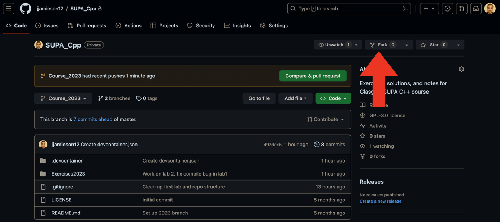
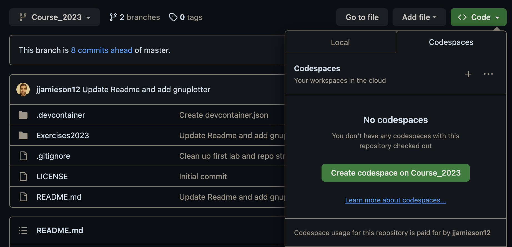
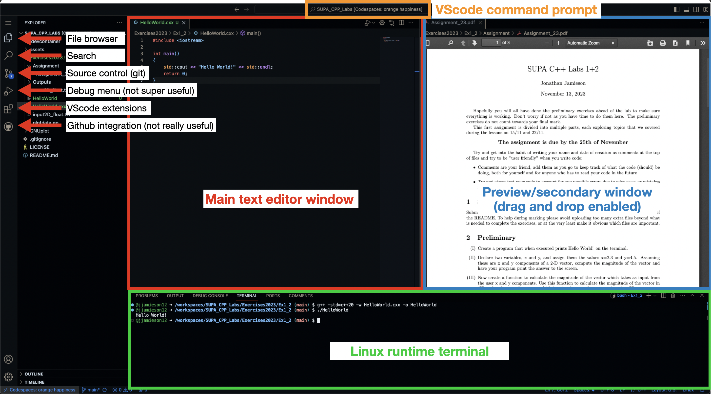
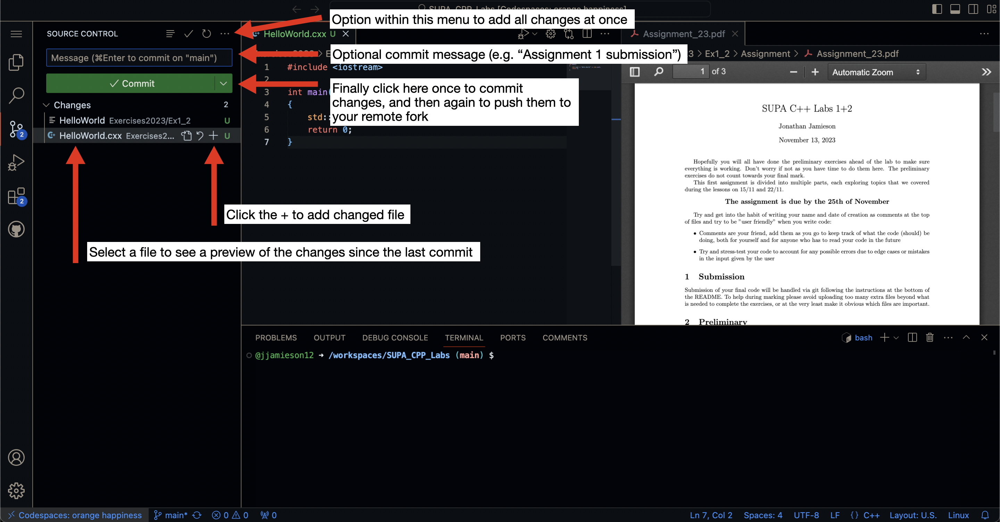
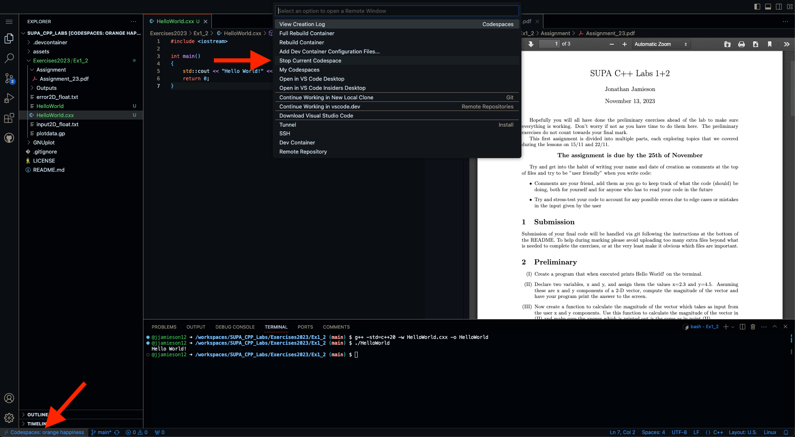

# SUPA_Cpp
Lab exercises and development environment for Glasgow SUPA C++ course, winter 2023

## Getting started

Welcome to 2023 SUPA C++ course. This year we are providing a ready-made development environment using [github codespaces](https://github.com/features/codespaces) that should hopefully make things run more smoothly and reduce the number of prerequisites needed to get started.

## Prerequisites:

1) A personal github account
    - Click [here](https://github.com/login) to login or sign up
2) A fork of this repository
    - Click [here](https://github.com/jjamieson12/SUPA_Cpp/fork) or on the button shown below:

## Starting the codespace

On the github page for **your fork** of this repository, then select:\
Green <kbd>< > Code ▾</kbd> icon &rarr; <kbd>Codespaces</kbd> tab &rarr; <kbd>Create Codespace on main</kbd>:

This will start spooling up a new codespace instance. This shouldn't take any more than 5-10 minutes but won't be instant as it has to download and compile some packages on a virtual machine for you.

Once built you should be able to stop and start the codespace almost instantly, with all of your files and settings saved automatically.

## A quick guide to VScode

If you have never seen it before the layout of VScode can seem a bit daunting but it is ultimately very functional. The main components of the interface are highlighted below:

The most important parts for the lab are the main editor window (where you will write your code), the terminal (where you will compile and run it, and the source control (git) tab on the left.

This keeps track of any changes you make and is what you will use to submit your final code. In the image above the blue 2 indicates that there are two files that have changed recently. When you have code you want to submit open this tab, choose all of the files you would like to add, optionally write a commit message at the top, and finally click <kbd>commit</kbd> and <kbd>sync changes</kbd>:

Some notes on codespaces:
- Provided you have a personal github account you should automatically get 60 core-hours of free codespace usage per-month, which should easily be enough for this course. 
    - If you go over your allowance it may be possible to extend it for free by registering a student github account but I haven't been able to verify this for obvious reasons
- Related to the point above if you close down the tab your codespace is running in it will continue to run, and use up your allocation, for some time until the instance is automatically suspended. 
    - To manually stop a codespace you can click the grey bar on the bottom left:
    
    - Alternatively <kbd>shift</kbd>+<kbd>command</kbd>/<kbd>ctrl</kbd>+<kbd>P</kbd> should bring up the command bar and type _Codespaces: Stop Current Codespace_
- The codespace itself is a virtual machine hosting an Ubuntu 22.04.3 image and a few pre-compiled packages. The image is linked to a VScode web-instance which acts as the remote-session host. 
    - Part of the setup process also downloads a few useful VScode extensions, if you have any of your own favourites feel free to download them as you normally would, though beware some extensions do not work on the web-version of VScode (dev)
    - Naturally the github extension is also downloaded by default (under source-control in the side-bar). You can use this to upload your final code by adding and commiting your code changes and then pushing them to your fork.